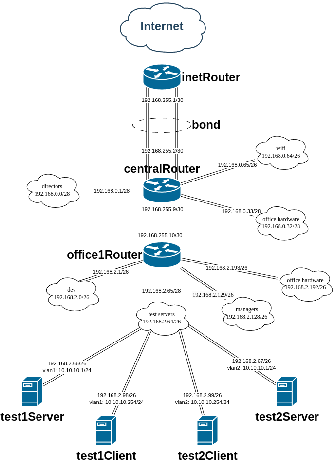

# Строим bond'ы и vlan'ы

## Задание

В **Office1** в тестовой подсети появляется сервера с доп интерфейсами и адресами в **internal** сети **test servers**:

- **testClient1** - 10.10.10.254
- **testClient2** - 10.10.10.254
- **testServer1** - 10.10.10.1
- **testServer2** - 10.10.10.1

Равести **vlan**'ами:

- **testClient1** <-> **testServer1**
- **testClient2** <-> **testServer2**

Между **centralRouter** и **inetRouter** "пробросить" 2 линка (общая **internal** сеть) и объединить их в **bond**, проверить работу c отключением интерфейсов.

## Cхема сети



## Реализация

Задание сделано на **rockylinux/9** версии **v4.0.0**. Для автоматизации процесса написан **Ansible Playbook** [playbook.yml](playbook.yml) который последовательно запускает следующие роли:

- **ip_forward** - включает **ip forwarding** на маршрутизаторах.
- **nftables** - включает **masquerade** на **nftables** на **inetRouter**.
- **network_config** - настраивает сеть на всех узлах (через **nmcli**). Роль доработана так, чтобы помимо поддерживаемых модулем **nmcli** опций можно было использовать любые опции **NetworkManager** через параметр **custom**.

Используется конфигурация сети, определённая в [host_vars](host_vars):

- [inetRouter](host_vars/inetRouter.yml);
- [centralRouter](host_vars/centralRouter.yml);
- [office1Router](host_vars/office1Router.yml);
- [test1Client](host_vars/test1Client.yml);
- [test1Server](host_vars/test1Server.yml);
- [test2Client](host_vars/test2Client.yml);
- [test2Server](host_vars/test2Server.yml).

Настройки **vlan** указаны в файлах (параметры **vlandev** и **vlanid**):

- [test1Client](host_vars/test1Client.yml);
- [test1Server](host_vars/test1Server.yml);
- [test2Client](host_vars/test2Client.yml);
- [test2Server](host_vars/test2Server.yml).

В качестве **bonding** настроен **802.3ad LACP** с режимом балансировки **layer3+4** и отправкой **LACPDU** каждую секунду (**LACP rate: fast** - `custom: [[bond, lacp_rate, 1]]` для **bond** интерфейсов). Тут важно отметить, что **VirtualBox** и драйвера сети в составе **RockyLinux** блокируют пакеты, если **MAC** отправителя не равен постоянному (**permaddr**) **MAC** сетевого интерфейса. Для решения этой проблемы были сделаны следующие настройки:

- В [Vagrantfile](Vagrantfile) была добавлена строчка `:modifyvm => ['--nicpromisc2', 'allow-vms', '--nicpromisc3', 'allow-vms']`, которая разрешает такие пакеты со стороны **VirtualBox**.
- В конфигурационных файлах для [inetRouter](host_vars/inetRouter.yml) и [centralRouter](host_vars/centralRouter.yml) была добавлена строчка `custom: [[ethernet, accept-all-mac-addresses, 1]]`, которая разрешает такие пакеты со стороны ядра **Linux**.

## Запуск

Необходимо скачать **VagrantBox** для **rockylinux/9** версии **v4.0.0** и добавить его в **Vagrant** под именем **rockylinux/9/v4.0.0**. Сделать это можно командами:

```shell
curl -OL https://app.vagrantup.com/rockylinux/boxes/9/versions/4.0.0/providers/virtualbox/amd64/vagrant.box
vagrant box add vagrant.box --name "rockylinux/9/v4.0.0"
rm vagrant.box
```

Для того, чтобы **vagrant 2.3.7** работал с **VirtualBox 7.1.0** необходимо добавить эту версию в **driver_map** в файле **/usr/share/vagrant/gems/gems/vagrant-2.3.7/plugins/providers/virtualbox/driver/meta.rb**:

```ruby
          driver_map   = {
            "4.0" => Version_4_0,
            "4.1" => Version_4_1,
            "4.2" => Version_4_2,
            "4.3" => Version_4_3,
            "5.0" => Version_5_0,
            "5.1" => Version_5_1,
            "5.2" => Version_5_2,
            "6.0" => Version_6_0,
            "6.1" => Version_6_1,
            "7.0" => Version_7_0,
            "7.1" => Version_7_0,
          }
```

После этого нужно сделать **vagrant up**.

Протестировано в **OpenSUSE Tumbleweed**:

- **Vagrant 2.3.7**
- **VirtualBox 7.1.4_SUSE r165100**
- **Ansible 2.17.6**
- **Python 3.11.10**
- **Jinja2 3.1.4**

## Проверка

Посмотрим сетевые настройки **test1Client**:

```text
❯ vagrant ssh test1Client -c 'ip address'
1: lo: <LOOPBACK,UP,LOWER_UP> mtu 65536 qdisc noqueue state UNKNOWN group default qlen 1000
    link/loopback 00:00:00:00:00:00 brd 00:00:00:00:00:00
    inet 127.0.0.1/8 scope host lo
       valid_lft forever preferred_lft forever
    inet6 ::1/128 scope host
       valid_lft forever preferred_lft forever
2: eth0: <BROADCAST,MULTICAST,UP,LOWER_UP> mtu 1500 qdisc fq_codel state UP group default qlen 1000
    link/ether 08:00:27:fc:e9:96 brd ff:ff:ff:ff:ff:ff
    altname enp0s3
    inet 10.0.2.15/24 brd 10.0.2.255 scope global dynamic noprefixroute eth0
       valid_lft 85510sec preferred_lft 85510sec
    inet6 fd00::a00:27ff:fefc:e996/64 scope global dynamic mngtmpaddr
       valid_lft 86205sec preferred_lft 14205sec
3: eth1: <BROADCAST,MULTICAST,UP,LOWER_UP> mtu 1500 qdisc fq_codel state UP group default qlen 1000
    link/ether 08:00:27:b5:55:51 brd ff:ff:ff:ff:ff:ff
    altname enp0s8
    inet 192.168.2.98/26 brd 192.168.2.127 scope global noprefixroute eth1
       valid_lft forever preferred_lft forever
    inet6 fe80::4e73:3cf2:6bdc:5e18/64 scope link noprefixroute
       valid_lft forever preferred_lft forever
4: eth1.1@eth1: <BROADCAST,MULTICAST,UP,LOWER_UP> mtu 1500 qdisc noqueue state UP group default qlen 1000
    link/ether 08:00:27:b5:55:51 brd ff:ff:ff:ff:ff:ff
    inet 10.10.10.254/24 brd 10.10.10.255 scope global noprefixroute eth1.1
       valid_lft forever preferred_lft forever
    inet6 fe80::8b78:e738:c202:a399/64 scope link noprefixroute
       valid_lft forever preferred_lft forever
```

Посмотрим сетевые настройки **test1Server**:

```text
❯ vagrant ssh test1Server -c 'ip address'
1: lo: <LOOPBACK,UP,LOWER_UP> mtu 65536 qdisc noqueue state UNKNOWN group default qlen 1000
    link/loopback 00:00:00:00:00:00 brd 00:00:00:00:00:00
    inet 127.0.0.1/8 scope host lo
       valid_lft forever preferred_lft forever
    inet6 ::1/128 scope host
       valid_lft forever preferred_lft forever
2: eth0: <BROADCAST,MULTICAST,UP,LOWER_UP> mtu 1500 qdisc fq_codel state UP group default qlen 1000
    link/ether 08:00:27:fc:e9:96 brd ff:ff:ff:ff:ff:ff
    altname enp0s3
    inet 10.0.2.15/24 brd 10.0.2.255 scope global dynamic noprefixroute eth0
       valid_lft 85458sec preferred_lft 85458sec
    inet6 fd00::a00:27ff:fefc:e996/64 scope global dynamic mngtmpaddr
       valid_lft 86186sec preferred_lft 14186sec
3: eth1: <BROADCAST,MULTICAST,UP,LOWER_UP> mtu 1500 qdisc fq_codel state UP group default qlen 1000
    link/ether 08:00:27:1e:6d:03 brd ff:ff:ff:ff:ff:ff
    altname enp0s8
    inet 192.168.2.66/26 brd 192.168.2.127 scope global noprefixroute eth1
       valid_lft forever preferred_lft forever
    inet6 fe80::8efc:b36b:773f:9b29/64 scope link noprefixroute
       valid_lft forever preferred_lft forever
4: eth1.1@eth1: <BROADCAST,MULTICAST,UP,LOWER_UP> mtu 1500 qdisc noqueue state UP group default qlen 1000
    link/ether 08:00:27:1e:6d:03 brd ff:ff:ff:ff:ff:ff
    inet 10.10.10.1/24 brd 10.10.10.255 scope global noprefixroute eth1.1
       valid_lft forever preferred_lft forever
    inet6 fe80::d19b:2571:208d:5122/64 scope link noprefixroute
       valid_lft forever preferred_lft forever
```

Посмотрим сетевые настройки **test2Client**:

```text
❯ vagrant ssh test2Client -c 'ip address'
1: lo: <LOOPBACK,UP,LOWER_UP> mtu 65536 qdisc noqueue state UNKNOWN group default qlen 1000
    link/loopback 00:00:00:00:00:00 brd 00:00:00:00:00:00
    inet 127.0.0.1/8 scope host lo
       valid_lft forever preferred_lft forever
    inet6 ::1/128 scope host
       valid_lft forever preferred_lft forever
2: eth0: <BROADCAST,MULTICAST,UP,LOWER_UP> mtu 1500 qdisc fq_codel state UP group default qlen 1000
    link/ether 08:00:27:fc:e9:96 brd ff:ff:ff:ff:ff:ff
    altname enp0s3
    inet 10.0.2.15/24 brd 10.0.2.255 scope global dynamic noprefixroute eth0
       valid_lft 85406sec preferred_lft 85406sec
    inet6 fd00::a00:27ff:fefc:e996/64 scope global dynamic mngtmpaddr
       valid_lft 85898sec preferred_lft 13898sec
3: eth1: <BROADCAST,MULTICAST,UP,LOWER_UP> mtu 1500 qdisc fq_codel state UP group default qlen 1000
    link/ether 08:00:27:2b:89:95 brd ff:ff:ff:ff:ff:ff
    altname enp0s8
    inet 192.168.2.99/26 brd 192.168.2.127 scope global noprefixroute eth1
       valid_lft forever preferred_lft forever
    inet6 fe80::edee:794f:c9fd:3694/64 scope link noprefixroute
       valid_lft forever preferred_lft forever
4: eth1.2@eth1: <BROADCAST,MULTICAST,UP,LOWER_UP> mtu 1500 qdisc noqueue state UP group default qlen 1000
    link/ether 08:00:27:2b:89:95 brd ff:ff:ff:ff:ff:ff
    inet 10.10.10.254/24 brd 10.10.10.255 scope global noprefixroute eth1.2
       valid_lft forever preferred_lft forever
    inet6 fe80::c3cc:4ba8:9efb:3709/64 scope link noprefixroute
       valid_lft forever preferred_lft forever
```

Посмотрим сетевые настройки **test2Server**:

```text
❯ vagrant ssh test2Server -c 'ip address'
1: lo: <LOOPBACK,UP,LOWER_UP> mtu 65536 qdisc noqueue state UNKNOWN group default qlen 1000
    link/loopback 00:00:00:00:00:00 brd 00:00:00:00:00:00
    inet 127.0.0.1/8 scope host lo
       valid_lft forever preferred_lft forever
    inet6 ::1/128 scope host
       valid_lft forever preferred_lft forever
2: eth0: <BROADCAST,MULTICAST,UP,LOWER_UP> mtu 1500 qdisc fq_codel state UP group default qlen 1000
    link/ether 08:00:27:fc:e9:96 brd ff:ff:ff:ff:ff:ff
    altname enp0s3
    inet 10.0.2.15/24 brd 10.0.2.255 scope global dynamic noprefixroute eth0
       valid_lft 85402sec preferred_lft 85402sec
    inet6 fd00::a00:27ff:fefc:e996/64 scope global dynamic mngtmpaddr
       valid_lft 86180sec preferred_lft 14180sec
3: eth1: <BROADCAST,MULTICAST,UP,LOWER_UP> mtu 1500 qdisc fq_codel state UP group default qlen 1000
    link/ether 08:00:27:b5:d2:82 brd ff:ff:ff:ff:ff:ff
    altname enp0s8
    inet 192.168.2.67/26 brd 192.168.2.127 scope global noprefixroute eth1
       valid_lft forever preferred_lft forever
    inet6 fe80::e28c:1d08:4bc7:b844/64 scope link noprefixroute
       valid_lft forever preferred_lft forever
4: eth1.2@eth1: <BROADCAST,MULTICAST,UP,LOWER_UP> mtu 1500 qdisc noqueue state UP group default qlen 1000
    link/ether 08:00:27:b5:d2:82 brd ff:ff:ff:ff:ff:ff
    inet 10.10.10.1/24 brd 10.10.10.255 scope global noprefixroute eth1.2
       valid_lft forever preferred_lft forever
    inet6 fe80::80c9:4127:e3d6:5762/64 scope link noprefixroute
       valid_lft forever preferred_lft forever
```

Проверим, что **test1Client** видит **test1Server**:

```text
❯ vagrant ssh test1Client -c 'ping -c 4 10.10.10.1'
PING 10.10.10.1 (10.10.10.1) 56(84) bytes of data.
64 bytes from 10.10.10.1: icmp_seq=1 ttl=64 time=0.247 ms
64 bytes from 10.10.10.1: icmp_seq=2 ttl=64 time=0.260 ms
64 bytes from 10.10.10.1: icmp_seq=3 ttl=64 time=0.191 ms
64 bytes from 10.10.10.1: icmp_seq=4 ttl=64 time=0.299 ms

--- 10.10.10.1 ping statistics ---
4 packets transmitted, 4 received, 0% packet loss, time 3233ms
rtt min/avg/max/mdev = 0.191/0.249/0.299/0.038 ms
```

Проверим, что **test2Client** видит **test2Server**:

```text
❯ vagrant ssh test2Client -c 'ping -c 4 10.10.10.1'
PING 10.10.10.1 (10.10.10.1) 56(84) bytes of data.
64 bytes from 10.10.10.1: icmp_seq=1 ttl=64 time=0.346 ms
64 bytes from 10.10.10.1: icmp_seq=2 ttl=64 time=0.198 ms
64 bytes from 10.10.10.1: icmp_seq=3 ttl=64 time=0.187 ms
64 bytes from 10.10.10.1: icmp_seq=4 ttl=64 time=0.215 ms

--- 10.10.10.1 ping statistics ---
4 packets transmitted, 4 received, 0% packet loss, time 3190ms
rtt min/avg/max/mdev = 0.187/0.236/0.346/0.064 ms
```

Проверим, что **test1Client** НЕ видит **test2Server**:

```text
❯ vagrant ssh test1Server -c 'sudo ip link set dev eth1.1 down'

❯ vagrant ssh test1Client -c 'ping -c 4 10.10.10.1'
PING 10.10.10.1 (10.10.10.1) 56(84) bytes of data.

--- 10.10.10.1 ping statistics ---
4 packets transmitted, 0 received, 100% packet loss, time 3209ms


❯ vagrant ssh test1Server -c 'sudo ip link set dev eth1.1 up'
```

Проверим, что **test2Client** НЕ видит **test1Server**:

```text
❯ vagrant ssh test2Server -c 'sudo ip link set dev eth1.2 down'

❯ vagrant ssh test2Client -c 'ping -c 4 10.10.10.1'
PING 10.10.10.1 (10.10.10.1) 56(84) bytes of data.

--- 10.10.10.1 ping statistics ---
4 packets transmitted, 0 received, 100% packet loss, time 3207ms


❯ vagrant ssh test2Server -c 'sudo ip link set dev eth1.2 up'
```

Посмотрим настройки **LACP** на **inetRouter**:

```text
❯ vagrant ssh inetRouter -c 'cat /proc/net/bonding/bond0'
Ethernet Channel Bonding Driver: v5.14.0-427.13.1.el9_4.x86_64

Bonding Mode: IEEE 802.3ad Dynamic link aggregation
Transmit Hash Policy: layer3+4 (1)
MII Status: up
MII Polling Interval (ms): 100
Up Delay (ms): 0
Down Delay (ms): 0
Peer Notification Delay (ms): 0

802.3ad info
LACP active: on
LACP rate: fast
Min links: 0
Aggregator selection policy (ad_select): stable

Slave Interface: eth1
MII Status: up
Speed: 1000 Mbps
Duplex: full
Link Failure Count: 0
Permanent HW addr: 08:00:27:1b:2c:55
Slave queue ID: 0
Aggregator ID: 1
Actor Churn State: none
Partner Churn State: none
Actor Churned Count: 0
Partner Churned Count: 0

Slave Interface: eth2
MII Status: up
Speed: 1000 Mbps
Duplex: full
Link Failure Count: 0
Permanent HW addr: 08:00:27:63:49:47
Slave queue ID: 0
Aggregator ID: 1
Actor Churn State: none
Partner Churn State: none
Actor Churned Count: 0
Partner Churned Count: 0
```

Посмотрим настройки **LACP** на **centralRouter**:

```text
❯ vagrant ssh centralRouter -c 'cat /proc/net/bonding/bond0'
Ethernet Channel Bonding Driver: v5.14.0-427.13.1.el9_4.x86_64

Bonding Mode: IEEE 802.3ad Dynamic link aggregation
Transmit Hash Policy: layer3+4 (1)
MII Status: up
MII Polling Interval (ms): 100
Up Delay (ms): 0
Down Delay (ms): 0
Peer Notification Delay (ms): 0

802.3ad info
LACP active: on
LACP rate: fast
Min links: 0
Aggregator selection policy (ad_select): stable

Slave Interface: eth1
MII Status: up
Speed: 1000 Mbps
Duplex: full
Link Failure Count: 0
Permanent HW addr: 08:00:27:12:aa:b4
Slave queue ID: 0
Aggregator ID: 1
Actor Churn State: none
Partner Churn State: none
Actor Churned Count: 0
Partner Churned Count: 0

Slave Interface: eth2
MII Status: up
Speed: 1000 Mbps
Duplex: full
Link Failure Count: 0
Permanent HW addr: 08:00:27:e2:56:e3
Slave queue ID: 0
Aggregator ID: 1
Actor Churn State: none
Partner Churn State: none
Actor Churned Count: 0
Partner Churned Count: 0
```

Посмотрим сетевые настройки **inetRouter**:

```text
❯ vagrant ssh inetRouter -c 'ip address'
1: lo: <LOOPBACK,UP,LOWER_UP> mtu 65536 qdisc noqueue state UNKNOWN group default qlen 1000
    link/loopback 00:00:00:00:00:00 brd 00:00:00:00:00:00
    inet 127.0.0.1/8 scope host lo
       valid_lft forever preferred_lft forever
    inet6 ::1/128 scope host
       valid_lft forever preferred_lft forever
2: eth0: <BROADCAST,MULTICAST,UP,LOWER_UP> mtu 1500 qdisc fq_codel state UP group default qlen 1000
    link/ether 08:00:27:fc:e9:96 brd ff:ff:ff:ff:ff:ff
    altname enp0s3
    inet 10.0.2.15/24 brd 10.0.2.255 scope global dynamic noprefixroute eth0
       valid_lft 84435sec preferred_lft 84435sec
    inet6 fd00::a00:27ff:fefc:e996/64 scope global dynamic mngtmpaddr
       valid_lft 86067sec preferred_lft 14067sec
    inet6 fe80::a00:27ff:fefc:e996/64 scope link
       valid_lft forever preferred_lft forever
3: eth1: <BROADCAST,MULTICAST,PROMISC,SLAVE,UP,LOWER_UP> mtu 1500 qdisc fq_codel master bond0 state UP group default qlen 1000
    link/ether 08:00:27:1b:2c:55 brd ff:ff:ff:ff:ff:ff
    altname enp0s8
4: eth2: <BROADCAST,MULTICAST,PROMISC,SLAVE,UP,LOWER_UP> mtu 1500 qdisc fq_codel master bond0 state UP group default qlen 1000
    link/ether 08:00:27:1b:2c:55 brd ff:ff:ff:ff:ff:ff permaddr 08:00:27:63:49:47
    altname enp0s9
6: bond0: <BROADCAST,MULTICAST,MASTER,UP,LOWER_UP> mtu 1500 qdisc noqueue state UP group default qlen 1000
    link/ether 08:00:27:1b:2c:55 brd ff:ff:ff:ff:ff:ff
    inet 192.168.255.1/30 brd 192.168.255.3 scope global noprefixroute bond0
       valid_lft forever preferred_lft forever
    inet6 fe80::c16e:ede6:12ab:fb93/64 scope link noprefixroute
       valid_lft forever preferred_lft forever
```

Посмотрим сетевые настройки **centralRouter**:

```text
❯ vagrant ssh centralRouter -c 'ip address'
1: lo: <LOOPBACK,UP,LOWER_UP> mtu 65536 qdisc noqueue state UNKNOWN group default qlen 1000
    link/loopback 00:00:00:00:00:00 brd 00:00:00:00:00:00
    inet 127.0.0.1/8 scope host lo
       valid_lft forever preferred_lft forever
    inet6 ::1/128 scope host
       valid_lft forever preferred_lft forever
2: eth0: <BROADCAST,MULTICAST,UP,LOWER_UP> mtu 1500 qdisc fq_codel state UP group default qlen 1000
    link/ether 08:00:27:fc:e9:96 brd ff:ff:ff:ff:ff:ff
    altname enp0s3
    inet 10.0.2.15/24 brd 10.0.2.255 scope global dynamic noprefixroute eth0
       valid_lft 84592sec preferred_lft 84592sec
    inet6 fd00::a00:27ff:fefc:e996/64 scope global dynamic mngtmpaddr
       valid_lft 86380sec preferred_lft 14380sec
3: eth1: <BROADCAST,MULTICAST,PROMISC,SLAVE,UP,LOWER_UP> mtu 1500 qdisc fq_codel master bond0 state UP group default qlen 1000
    link/ether 08:00:27:12:aa:b4 brd ff:ff:ff:ff:ff:ff
    altname enp0s8
4: eth2: <BROADCAST,MULTICAST,PROMISC,SLAVE,UP,LOWER_UP> mtu 1500 qdisc fq_codel master bond0 state UP group default qlen 1000
    link/ether 08:00:27:12:aa:b4 brd ff:ff:ff:ff:ff:ff permaddr 08:00:27:e2:56:e3
    altname enp0s9
5: eth3: <BROADCAST,MULTICAST,UP,LOWER_UP> mtu 1500 qdisc fq_codel state UP group default qlen 1000
    link/ether 08:00:27:43:dc:62 brd ff:ff:ff:ff:ff:ff
    altname enp0s10
    inet 192.168.255.9/30 brd 192.168.255.11 scope global noprefixroute eth3
       valid_lft forever preferred_lft forever
    inet6 fe80::32a1:9038:9881:97f6/64 scope link noprefixroute
       valid_lft forever preferred_lft forever
6: eth4: <BROADCAST,MULTICAST,UP,LOWER_UP> mtu 1500 qdisc fq_codel state UP group default qlen 1000
    link/ether 08:00:27:f9:2a:46 brd ff:ff:ff:ff:ff:ff
    altname enp0s16
    inet 192.168.0.1/28 brd 192.168.0.15 scope global noprefixroute eth4
       valid_lft forever preferred_lft forever
    inet6 fe80::549f:2718:4d0:f60d/64 scope link noprefixroute
       valid_lft forever preferred_lft forever
7: eth5: <BROADCAST,MULTICAST,UP,LOWER_UP> mtu 1500 qdisc fq_codel state UP group default qlen 1000
    link/ether 08:00:27:4a:f3:1d brd ff:ff:ff:ff:ff:ff
    altname enp0s17
    inet 192.168.0.33/28 brd 192.168.0.47 scope global noprefixroute eth5
       valid_lft forever preferred_lft forever
    inet6 fe80::367f:d24f:420a:1631/64 scope link noprefixroute
       valid_lft forever preferred_lft forever
8: eth6: <BROADCAST,MULTICAST,UP,LOWER_UP> mtu 1500 qdisc fq_codel state UP group default qlen 1000
    link/ether 08:00:27:a5:8c:7c brd ff:ff:ff:ff:ff:ff
    altname enp0s18
    inet 192.168.0.65/26 brd 192.168.0.127 scope global noprefixroute eth6
       valid_lft forever preferred_lft forever
    inet6 fe80::c388:db26:6084:460b/64 scope link noprefixroute
       valid_lft forever preferred_lft forever
10: bond0: <BROADCAST,MULTICAST,MASTER,UP,LOWER_UP> mtu 1500 qdisc noqueue state UP group default qlen 1000
    link/ether 08:00:27:12:aa:b4 brd ff:ff:ff:ff:ff:ff
    inet 192.168.255.2/30 brd 192.168.255.3 scope global noprefixroute bond0
       valid_lft forever preferred_lft forever
    inet6 fe80::3eb7:fcad:22be:c986/64 scope link noprefixroute
       valid_lft forever preferred_lft forever
```

Проверим работу канала между **inetRouter** и **centralRouter**:

```text
❯ vagrant ssh inetRouter -c 'ping -c 4 192.168.255.2'
PING 192.168.255.2 (192.168.255.2) 56(84) bytes of data.
64 bytes from 192.168.255.2: icmp_seq=1 ttl=64 time=0.235 ms
64 bytes from 192.168.255.2: icmp_seq=2 ttl=64 time=0.306 ms
64 bytes from 192.168.255.2: icmp_seq=3 ttl=64 time=0.293 ms
64 bytes from 192.168.255.2: icmp_seq=4 ttl=64 time=0.325 ms

--- 192.168.255.2 ping statistics ---
4 packets transmitted, 4 received, 0% packet loss, time 3222ms
rtt min/avg/max/mdev = 0.235/0.289/0.325/0.033 ms

❯ vagrant ssh centralRouter -c 'ping -c 4 192.168.255.1'
PING 192.168.255.1 (192.168.255.1) 56(84) bytes of data.
64 bytes from 192.168.255.1: icmp_seq=1 ttl=64 time=0.239 ms
64 bytes from 192.168.255.1: icmp_seq=2 ttl=64 time=0.156 ms
64 bytes from 192.168.255.1: icmp_seq=3 ttl=64 time=0.174 ms
64 bytes from 192.168.255.1: icmp_seq=4 ttl=64 time=0.448 ms

--- 192.168.255.1 ping statistics ---
4 packets transmitted, 4 received, 0% packet loss, time 3211ms
rtt min/avg/max/mdev = 0.156/0.254/0.448/0.116 ms
```

Проверим как отключение интерфейсов влияет на **ping**, отключив **eth1** и **eth2** на **centralRouter** во время **ping** с **inetRouter**:

```shell
vagrant ssh centralRouter -c 'sudo ip link set dev eth1 down'
vagrant ssh centralRouter -c 'sudo ip link set dev eth1 up'
vagrant ssh centralRouter -c 'sudo ip link set dev eth2 down'
vagrant ssh centralRouter -c 'sudo ip link set dev eth2 up'
```

При отключении **eth1** было потеряно 2 пакета:

```shell
❯ vagrant ssh inetRouter -c 'ping 192.168.255.2'
PING 192.168.255.2 (192.168.255.2) 56(84) bytes of data.
64 bytes from 192.168.255.2: icmp_seq=1 ttl=64 time=0.226 ms
...
64 bytes from 192.168.255.2: icmp_seq=14 ttl=64 time=0.297 ms
64 bytes from 192.168.255.2: icmp_seq=17 ttl=64 time=0.191 ms
...
64 bytes from 192.168.255.2: icmp_seq=60 ttl=64 time=0.185 ms
^C
--- 192.168.255.2 ping statistics ---
60 packets transmitted, 58 received, 3.33333% packet loss, time 63189ms
rtt min/avg/max/mdev = 0.160/0.215/0.375/0.039 ms
```

Ещё раз проверим информацию о **bond** на одном из серверах:

```text
❯ vagrant ssh inetRouter -c 'cat /proc/net/bonding/bond0'
Ethernet Channel Bonding Driver: v5.14.0-427.13.1.el9_4.x86_64

Bonding Mode: IEEE 802.3ad Dynamic link aggregation
Transmit Hash Policy: layer3+4 (1)
MII Status: up
MII Polling Interval (ms): 100
Up Delay (ms): 0
Down Delay (ms): 0
Peer Notification Delay (ms): 0

802.3ad info
LACP active: on
LACP rate: fast
Min links: 0
Aggregator selection policy (ad_select): stable

Slave Interface: eth1
MII Status: up
Speed: 1000 Mbps
Duplex: full
Link Failure Count: 0
Permanent HW addr: 08:00:27:1b:2c:55
Slave queue ID: 0
Aggregator ID: 1
Actor Churn State: none
Partner Churn State: none
Actor Churned Count: 0
Partner Churned Count: 0

Slave Interface: eth2
MII Status: up
Speed: 1000 Mbps
Duplex: full
Link Failure Count: 0
Permanent HW addr: 08:00:27:63:49:47
Slave queue ID: 0
Aggregator ID: 1
Actor Churn State: none
Partner Churn State: none
Actor Churned Count: 0
Partner Churned Count: 0

❯ vagrant ssh centralRouter -c 'cat /proc/net/bonding/bond0'
Ethernet Channel Bonding Driver: v5.14.0-427.13.1.el9_4.x86_64

Bonding Mode: IEEE 802.3ad Dynamic link aggregation
Transmit Hash Policy: layer3+4 (1)
MII Status: up
MII Polling Interval (ms): 100
Up Delay (ms): 0
Down Delay (ms): 0
Peer Notification Delay (ms): 0

802.3ad info
LACP active: on
LACP rate: fast
Min links: 0
Aggregator selection policy (ad_select): stable

Slave Interface: eth1
MII Status: up
Speed: 1000 Mbps
Duplex: full
Link Failure Count: 1
Permanent HW addr: 08:00:27:12:aa:b4
Slave queue ID: 0
Aggregator ID: 1
Actor Churn State: none
Partner Churn State: none
Actor Churned Count: 0
Partner Churned Count: 0

Slave Interface: eth2
MII Status: up
Speed: 1000 Mbps
Duplex: full
Link Failure Count: 1
Permanent HW addr: 08:00:27:e2:56:e3
Slave queue ID: 0
Aggregator ID: 1
Actor Churn State: none
Partner Churn State: none
Actor Churned Count: 0
Partner Churned Count: 0
```

Видно, что на **centralRouter** падали линки, однако они не падали **inetRouter**, при этом линк успешно переключился на резервный и **ping** восстановился.
